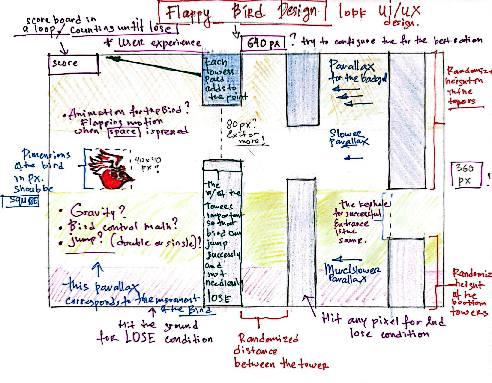

# FlappyBird the Game

## This is a FlappyBird Project 

My game is a FlabbyBird Project, a hit with all ages and demographics. You may never win but you might get a higher score thus the bragging rights in your local pub. Game is simple and complex at the same time as well as addicting.

## Main menu

## Canvas and sprites
> Game incorporates both canvas and sprites for a greater immersion and user experience. 

## The behavior and the gravity for user experience.

> The theoretical behavior and the physics of the bird and the randomness is known. The source of that is a paper by CS class at Columbia engineering. **reference:** [CSEngineeringColumbia](https://www.cs.columbia.edu/~sedwards/classes/2015/4840/reports/Flappy-Bird.pdf) 

## Paralax an important feature

> The important feature of this Flappy Bird game is ***Parallax*** (a feeling of infinites, and the sense of depth). It is important to get the parallax right and user pleasing experience. The source for images was a site in which I paid for those images thus all the legal rights to those images [2d Artist](https://bevouliin.com)

## WireFrame of the FlappyBird

The desired outcome of the game.

## Playing the game.

> You play the game by continuously pressing the jump button and in this case it is going to be **SPACE** button. The goal is to not hit the pipe by threading the keyhole and/or not hit the ground keeping the bird afloat at all times. I have also **D** button for quick dash for more fun. Unlike other flappy bird clones I have added twist if you hit the ground game becomes faster and harder. 

### User Story

* As a player, I want my game to feel aesthetically pleasing.
* As a player, I want to game to feel warm. 
* As a pleyer, I want my game to be responsive.
* As a player, I want my game to keep track of the score, and each score be meaningful.
* As a player, I want my game to be intuitive to every age demographics.

### Stretch Goals

* There is no win condition and player who the gets the biggest score can have bragging rights at your local bar. Maybe add a scorecard memory to see the all the record up to the last 10 players.
* I want to add audio and visuals if the player reaches certain scores to reward visally, and with audio cues. 
* Bragging rights and endurance are an important aspect of the game. 

| Day  	        |  Tasks	        |  Blockers 	|   Notes	|
|---	        |---	            |---	|---	|
|   Saturday	|   Paralax	        |   	|   	|
|   Sunday	    |   Sounds          |   	|   	|
|   Monday	    |   Start           |   	|   	|
|   Tuesday	    |   Audio	        |   	|   	|
|   Wednesday	|   DeadBird	    |   	|   	|
|   Thursday	|   More immersion  |      	|   	|

Link to the game 
[Flappy Bird](https://nuralysolflappybird.netlify.app/)

**PRESENTATION IS FRIDAY** 21 July 2024. 

Nuraly Soltonbekov
soltonbekov@gmail.com